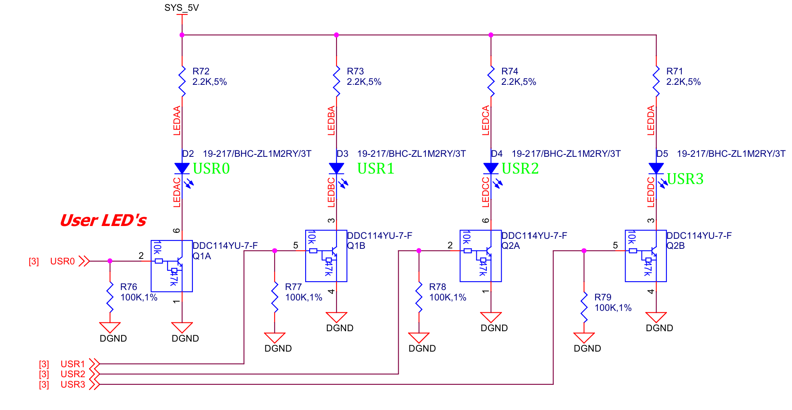
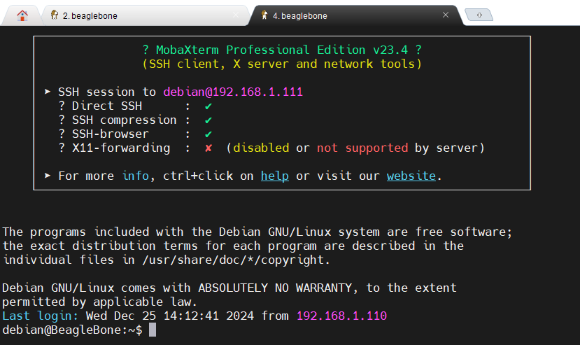
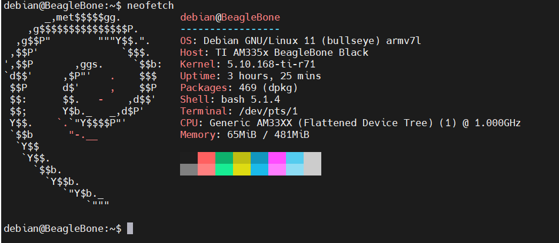
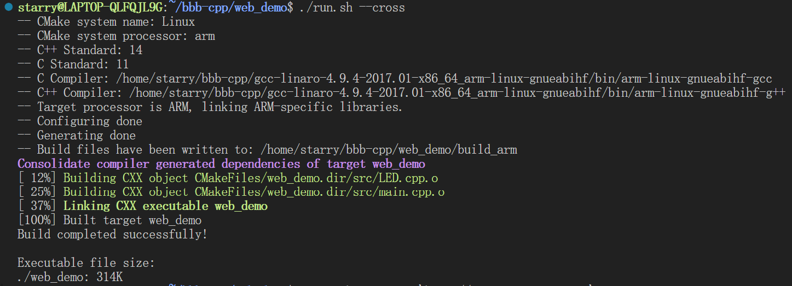
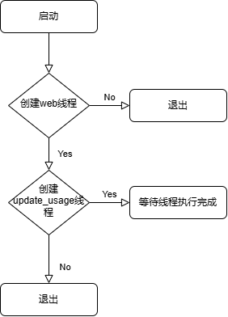
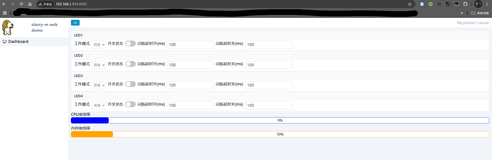

# bbb cpp web demo

work in linux platform,aims to cross paltform ,running in arm linux 
!
# 开源库使用

- 日志 ：~~spdlog~~
- web: [mongoose](https://github.com/cesanta/mongoose)


# start!!!
将模板mongoose wizard  复制进工程


## 测试使用

```shell
Wrote timer to /sys/class/leds/beaglebone:green:usr0/trigger
Failed to open file: /sys/class/leds/beaglebone:green:usr0/delay_on
Failed to open file: /sys/class/leds/beaglebone:green:usr0/delay_off

```
出现写入权限不足的情况，加sudo执行即可

``` shell
terminate called after throwing an instance of 'std::system_error'   what():  Enable multithreading to use std::thread: Operation not permitted Aborted
```
出现多线程使用失败的情况，链接Threads就可以了


#  Beaglebone Black 网页点灯报告

# 基于 Beaglebone Black 和 web 的点灯初尝试

# 一、任务要求

在系统中建立一个网页，并且与LED联动，使用网线连接到设备上时，可以从网页中控制LED的开关与闪烁

# 二、设计思路

## 认识板卡

本次我选择的是BeagleBone® Black ，上面是一块ARM cortex-A8架构的SOC，主频高达1G Hz,以及512MB DDR3 SDRAM 和4 GB eMMC Flash 存储器。性能强大，空间丰富。再加上官方适配的debian 发行版系统，可以让我们很方便的使用起来。

## web浅尝

本人之前一直做的是C语言+简单的单片机应用，基本没写过web相关的。而从前端三件套（html+css+js）入手学习太慢了,所以我希望能找到一个类似于qt那样的控件形式的页面制作工具。经过搜索还真让我找到了[Mongoose Wizard](https://mongoose.ws/wizard/)在嵌入式方便使用极其方便且简单的页面制作框架。

## 定下方案

Mongoose wizard将前端的静态资源全部整合到一个大数组中，再配合一些操作，做了一个简单的文件系统，提供静态资源。并实现好所有的API操作接口，我们最后只用关心mongoose_glue.c中的get和set函数。
值得注意的是我们的板子是arm架构的，电脑是x86架构的，为了方便调试，我们必然是在电脑上进行的，所以最终在板子上运行还涉及到了交叉编译。

# 三、实现过程

## 1、硬件电路分析

既然要点灯，那我们首先要关注的是灯在哪里

可见只要给控制io高低电平即可让灯亮灭。之所以加了三极管，应该是与手册中io的灌电流大小有关，减小亮灯时的灌电流。

## 2、准备环境

先到bbb官网找到最新版本debian系统镜像，我这里使用的是这个`am335x-debian-11.7-iot-armhf-2023-09-02-4gb.img`,再烧录的tf卡中，让系统从tf卡启动。
上电、插上网线。ssh连进去看看账号`debian`,密码`temppwd`

很好，下一步来个hello world

板子到这里应该就OK了，接下来看看我们电脑环境这边（我的系统是wsl2 ubuntu22.04 LTS）参考自这个博客[BeagleBone Black从入门到放弃（三）交叉编译器与交叉编译环境](https://blog.csdn.net/sumuzhe1511/article/details/90814123)
我最终使用这个交叉编译工具` gcc-linaro-4.9.4-2017.01-x86_64_arm-linux-gnueabihf.tar.xz`，注意不要用太新的，不然bbb板子上的glibc版本不一定支持这么高的。

## 3、实现原理分析

Mongoose相关的了解可以看看这个博客[简单易用的嵌入式网络库：Mongoose](https://zhuanlan.zhihu.com/p/503925620)，以及[github](https://github.com/cesanta/mongoose.git)。
mongoose中实现web服务器和网页之间的交互大致都是通过注册路由和函数到Handle中,主体框架那边再做处理，具体的还需要再学习分析，目前还没将源码看完。
再就是创建`cmake`项目，写`cmakelists.txt`，以及编译脚本`run.sh`
``` shell
#!/bin/bash
# 检查是否使用交叉编译工具链
USE_CROSS_COMPILE=false
for arg in "$@"
do
    if [ "$arg" == "--cross" ]; then
        USE_CROSS_COMPILE=true
        break
    fi
done

# 设置构建目录，根据是否使用交叉编译选择不同目录
if [ "$USE_CROSS_COMPILE" == true ]; then
    BUILD_DIR="build_arm"
else
    BUILD_DIR="build"
fi

# 保存当前路径
ROOTPATH=`pwd`

# 检查并创建构建目录
if [ ! -d "$ROOTPATH/$BUILD_DIR" ]; then
    mkdir "$ROOTPATH/$BUILD_DIR"
fi

# 进入构建目录
cd "$ROOTPATH/$BUILD_DIR"

# 检查并创建 log 目录
if [ ! -d "$ROOTPATH/$BUILD_DIR/log" ]; then
    mkdir "$ROOTPATH/$BUILD_DIR/log"
fi

# 运行 cmake，根据是否使用交叉编译来选择参数
if [ "$USE_CROSS_COMPILE" == true ]; then
    cmake -DCMAKE_TOOLCHAIN_FILE=../toolchain.cmake ..
else
    cmake ..
fi

# 检查 cmake 是否成功
if [ $? -ne 0 ]; then
    echo "CMake configuration failed!"
    exit 1
fi

# 运行 make
make

# 检查 make 是否成功
if [ $? -ne 0 ]; then
    echo "Build failed!"
    exit 1
fi

echo -e "Build completed successfully!\n"

# 打印可执行文件的大小
EXECUTABLE="./web_demo"
if [ -f "$EXECUTABLE" ]; then
    echo "Executable file size:"
    ls -lh "$EXECUTABLE" | awk '{print $9 ": " $5}'
else
    echo "Executable file not found!"
fi

# 运行生成的可执行文件（仅在非交叉编译情况下）
if [ "$USE_CROSS_COMPILE" == false ]; then
    ./web_demo
fi

```
只需要运行这个脚本即可编译出来最终的可执行文件。


## 4、软件流程分析



这里使用了多线程来运行，其中`web_thread`用来跑mongoose 网页，`update_cpu_mem_usage`用来更新cpu和mem使用率，


# 四、效果展示与遇到的问题

## 效果展示


具体间视频

## 遇到的问题

- 1.在线网页中设置好网页后，再去修改json文件，再编译运行，无效。仔细查看mongoose源码后发现，json已经嵌入到v1数组中。想要修改页面只能重新生成。

- 2.修改闪烁延时失败
```shell
Wrote timer to /sys/class/leds/beaglebone:green:usr0/trigger
Failed to open file: /sys/class/leds/beaglebone:green:usr0/delay_on
Failed to open file: /sys/class/leds/beaglebone:green:usr0/delay_off

```
出现写入权限不足的情况，加sudo执行即可

- 3.使用多线程失败
``` shell
terminate called after throwing an instance of 'std::system_error'   what():  Enable multithreading to use std::thread: Operation not permitted Aborted
```
出现多线程使用失败的情况，cmakelist中链接Threads就可以了

# 五、感想与未来计划

第一次尝试做web相关的项目，虽然这次取巧用了mongoose wizard，但是也让我对web有了进一步的了解，以及web的方便之处。电脑上只要有浏览器就能实现类似于上位机的效果，但是又不需要安装运行软件，很棒。
在我的工程源码中加入了fmt和simpleinih，虽然这次还没用到，但是这是我用cmake+cpp的初步尝试，后面结合这些东西可以做出更加丰富的功能，比如说物联网网关系统，涵盖设备注册、删除、数据收发、固件更新等功能。